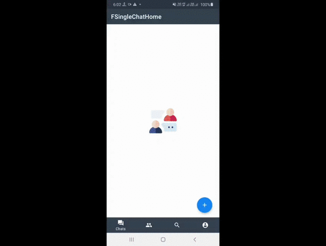

# Chat App
LetsChat is a Sample Messaging Android application built to demonstrate the use of Modern Android development tools - (Kotlin, Coroutines, Dagger-Hilt, Architecture Components, MVVM, Room, Coil) and Firebase

- Create a firebase project and replace the google-services.json file which you get from your firebase project console
- Following firebase services need to be enabled in the firebase console
  - Phone Auth
  - Cloud Firestore
  - Realtime Database
  - Storage
  - Composite indexes should be created for contact query(link for enabling indexes could be found from logcat while using the app)

***You can Install and test latest LetsChat app from below 👇***

  

 
## Features ✨
- One on one chat
- Group Chat
- Typing status for one on one and group chat
- Unread messages count
- Message status for failed,sent,delivered and seen
- Supported message types
  - Text
  - Voice
  - Sticker and Gif
- Attachments 
  - Image
  - Video - InProgress
- Notification actions for reply and mark as read
- Search users by username 

